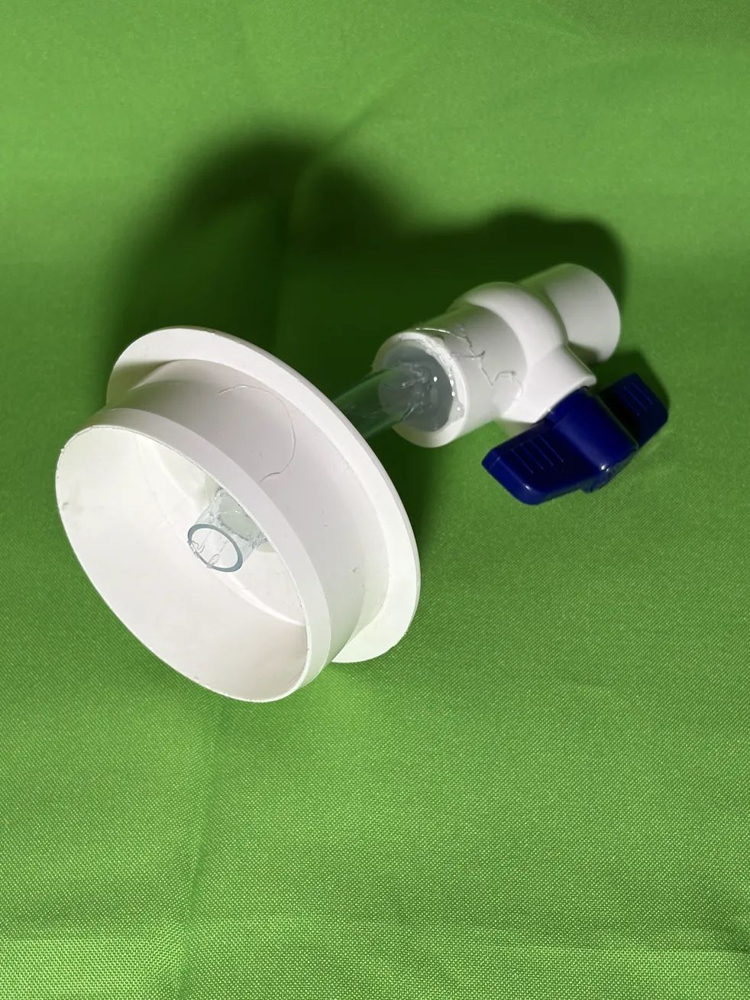
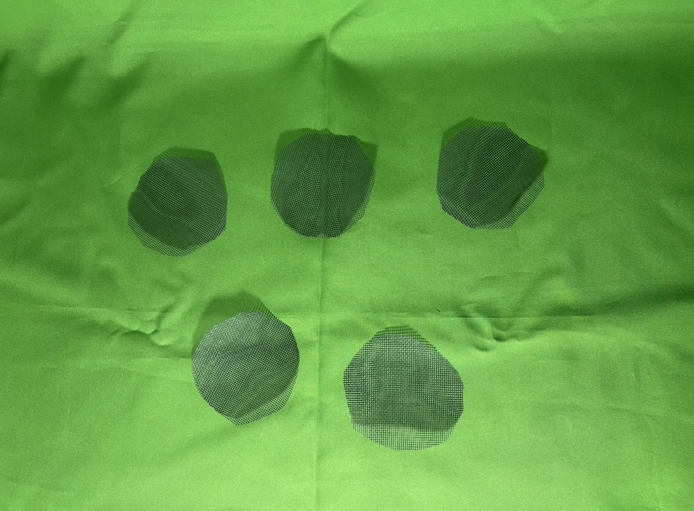
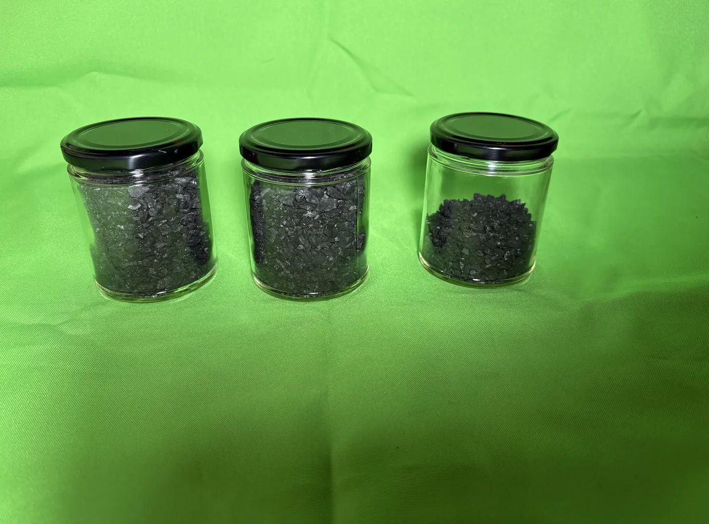
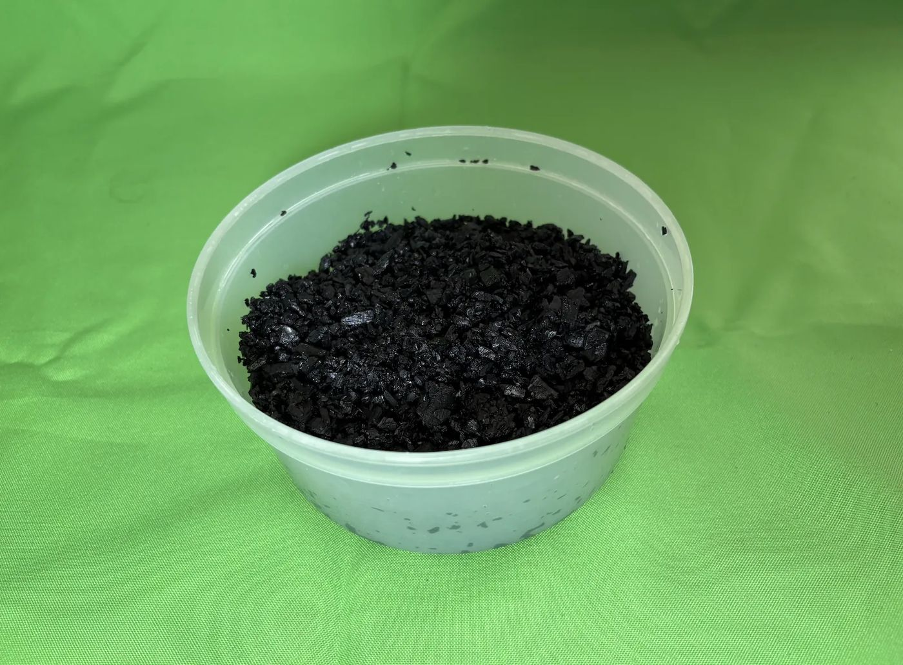
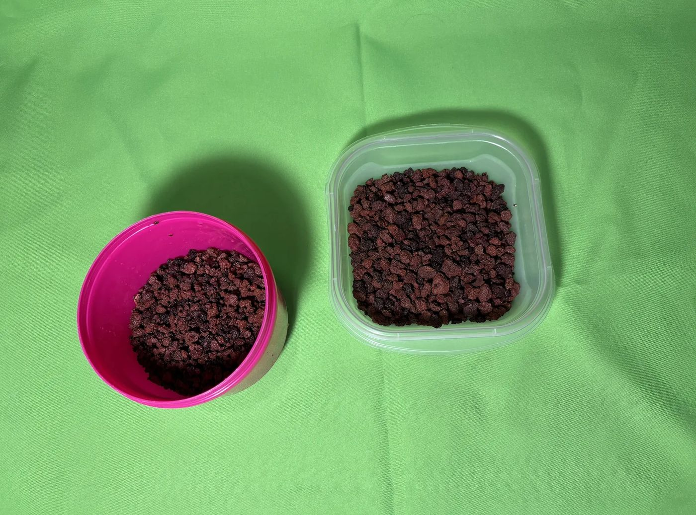
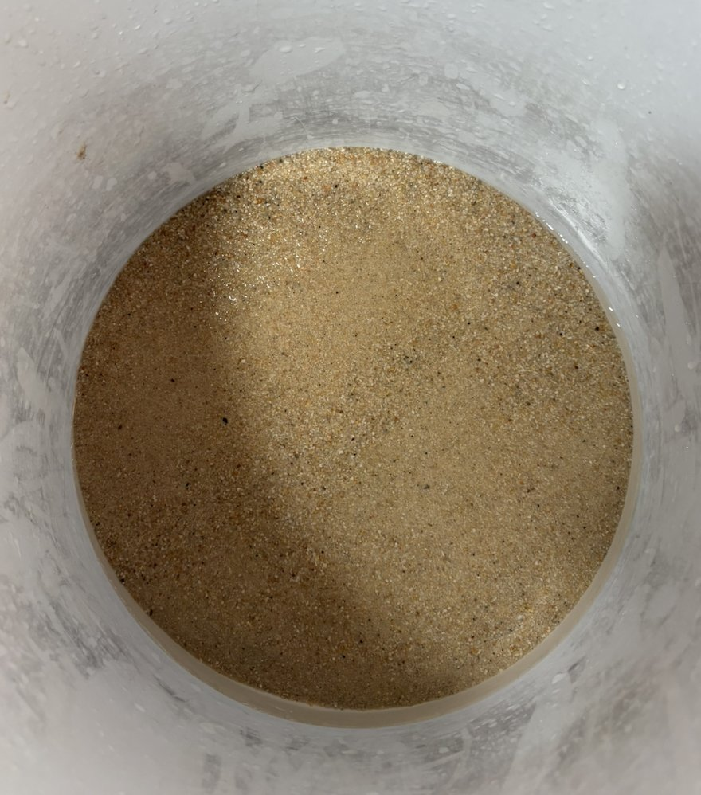

# Build log

Assembly as it happened, including what did not go to plan. No scale was used:
volumes were measured with 200 ml jars.

## Column body

PVC pipe, 3 in nominal, cut to 750 mm. The pipe is opaque, so each layer is
photographed from above as it goes in rather than through the wall.

## Outlet

A bore through a 3 in PVC end cap carries a length of clear ½ in hose into a
½ in ball valve. The cap slides onto the pipe over PTFE tape rather than being
cemented, so the column can be taken apart.

The first seal was hot-melt glue, which does not hold on wet PVC. It was stripped
out and replaced with two-part epoxy.

Leak test: filled with water and left for two hours. Not a drop came through.

## Layer separators

Five discs cut from plastic insect mesh: one under the support layer and one
between each pair of layers above it.

## Charcoal

Lump charcoal, crushed by hand inside nested bags. The fraction held on the
insect mesh was kept and the powder discarded.

| Stage | Volume |
| --- | --- |
| Crushed, dry | ≈ 500 ml |
| After topping up | ≈ 550–600 ml |

Rinsed and soaked overnight so it sinks instead of floating up through the layer
above. Some pieces would not crush below gravel size, so it is loaded as a graded
layer: coarse at the bottom, fine on top.

## Scoria

Sorted with the insect mesh and by hand into two fractions.

| Fraction | Volume | Destination |
| --- | --- | --- |
| Coarser | ≈ 300 ml | Layer 1, support |
| Finer | ≈ 500 ml | Layer 4, coarse top layer |

## Fine sand

Hand crushing stopped at gravel size, so neither scoria fraction is fine enough
for layer 3. A fine carbonate sand already on hand was tried first and set aside:
it kept releasing fines into the rinse water, and there was not enough of it.

Layer 3 uses aquarium-grade fine silica sand instead. Quartz does not break down
into fines the way carbonate does, and it leaves water chemistry unchanged. A
3 kg bag covers the ≈ 1.3 kg the layer needs and leaves enough to reload it.

Rinsed in a tub until the water ran clear.

## Still to do

- Check the rinsed sand's drainage in a perforated cup
- Load the column and wash the bed until the effluent runs clear
- Build the photometric rig and shoot the calibration series
