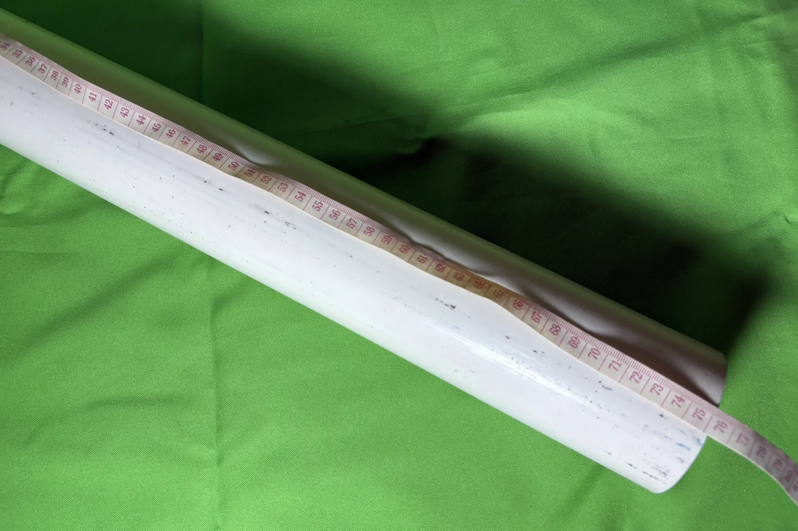
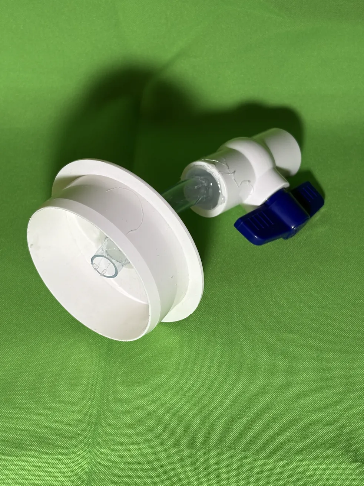
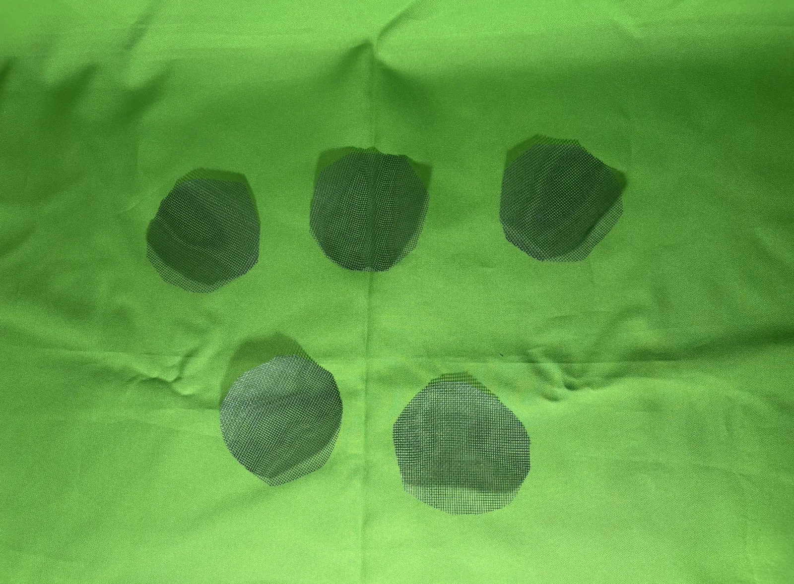
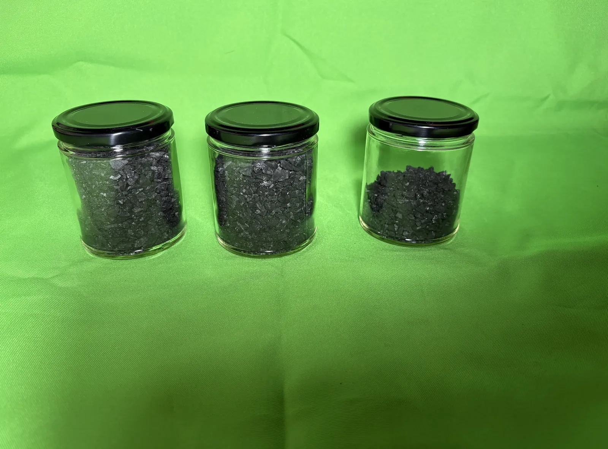
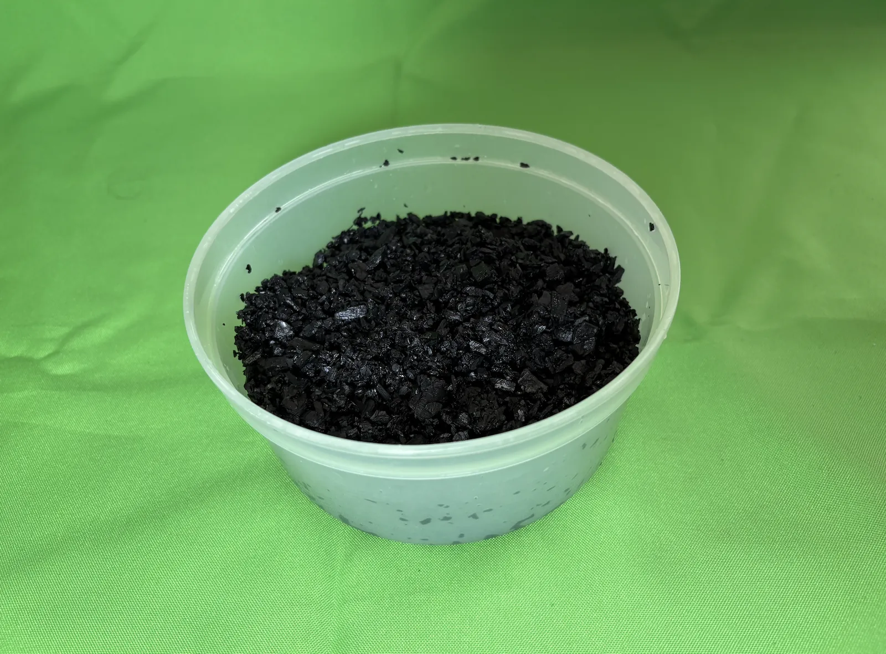
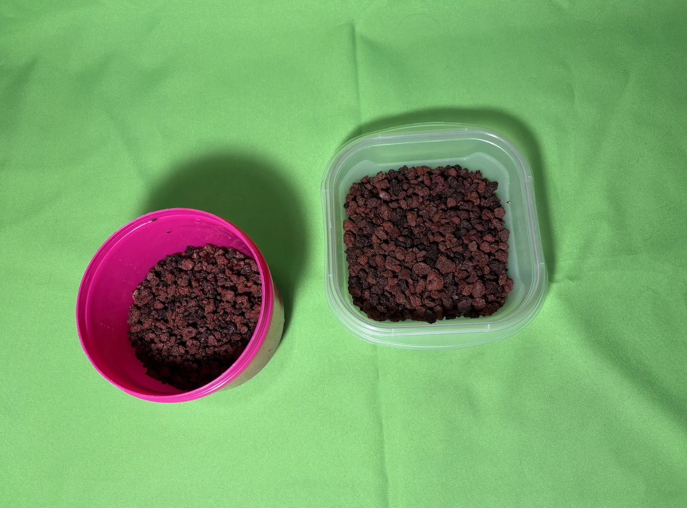

# Build log

Assembly as it happened, including what did not go to plan. No scale was used:
volumes were measured with 200 ml jars.

## Column body

PVC pipe, 3 in nominal, cut to 750 mm. The pipe is opaque, so each layer is
photographed from above as it goes in rather than through the wall.

## Outlet

A bore through a 3 in PVC end cap carries a length of clear ½ in hose into a
½ in ball valve. The cap slides onto the pipe over PTFE tape rather than being
cemented, so the column can be taken apart.

> [!WARNING]
> Not yet leak-tested. The outlet joint is waiting on a full-height test with the
> pipe filled to the top. Nothing goes into the column until it holds.

## Layer separators

Five discs cut from plastic insect mesh: one under the support layer and one
between each pair of layers above it.

## Charcoal

Lump charcoal, crushed by hand inside nested bags. The fraction held on the
insect mesh was kept and the powder discarded.

| Stage | Volume |
| --- | --- |
| Crushed, dry | ≈ 500 ml |
| After topping up | ≈ 550–600 ml |

Rinsed and soaked overnight so it sinks instead of floating up through the layer
above. Some pieces would not crush below gravel size, so it is loaded as a graded
layer: coarse at the bottom, fine on top.

## Scoria

Sorted with the insect mesh and by hand into two fractions.

| Fraction | Volume | Destination |
| --- | --- | --- |
| Coarser | ≈ 300 ml | Layer 1, support |
| Finer | ≈ 500 ml | Layer 4, coarse top layer |

> [!WARNING]
> Layer 3 is still missing. Hand crushing stopped at gravel size. Layer 3 needs
> grains small enough to pass the insect mesh, and neither fraction is that fine,
> so its medium is still to be sourced.

## Still to do

- Leak-test the outlet with the pipe full
- Source a sand-sized fraction for layer 3
- Load the column and wash the bed until the effluent runs clear
- Build the photometric rig and shoot the calibration series
