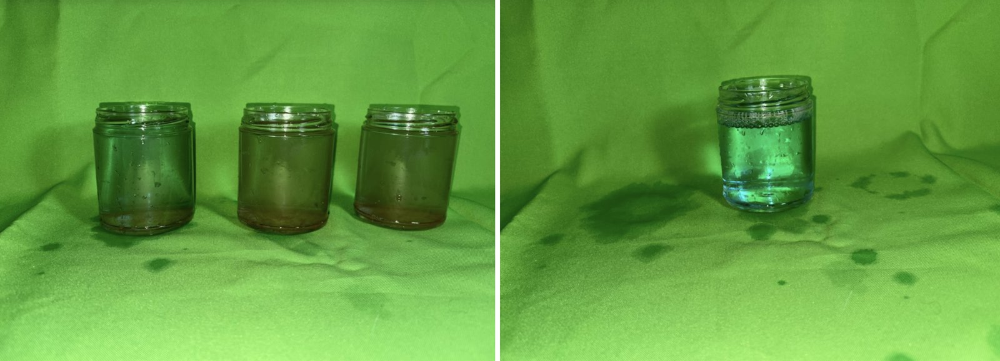

# Results

First runs, judged by eye. The photometric method was not used for them, so there is no removal percentage.

## Run 1 — dyed water

Water strongly dyed with blue food colouring was poured through the loaded column. The blue came through. The bed was then rinsed with clean water until the effluent ran almost clear.

## Run 2 — muddy water

Three jars of muddy water were poured into the column after the standing water had drained. Effluent started 5–10 seconds after pouring. It came out without the brown suspended solids, but tinted blue. A second jarful came out the same.

## What the runs show

- **Suspended solids are held back.** Cloudy brown water in, clear water out.
- **Dissolved colour is not.** Food colouring is dissolved, not suspended, so a sand bed cannot strain it out. The charcoal is lump charcoal, not activated carbon, and the water spends little time in contact with it.
- **The blue in Run 2 most likely came from Run 1.** Dye held in the bed washed out with the new water. This was not tested.

## Not done

- Photometric measurement with the target sheet and a calibration series
- Three charges with a measured flow rate
- Greywater mixed to the written recipe

## Next

- Rinse the bed until the effluent is colourless before any new run
- Throttle the valve to slow the flow and lengthen contact time
- Measure influent and effluent with the photometric method

> [!NOTE]
> Removal is reported relative to the influent, never in NTU. A number that cannot be defended is worse than a number that was never claimed.
